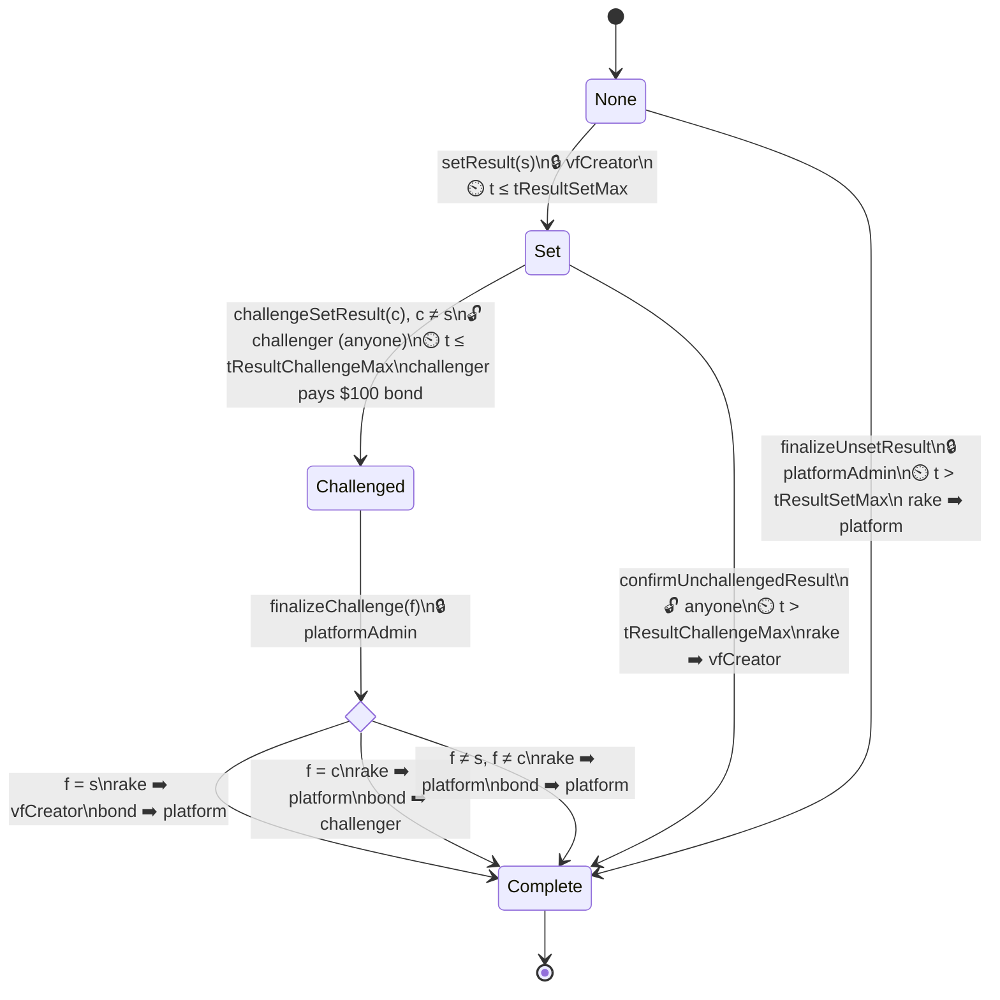

# `ChallengeableCreatorOracle` `Resolution.state` diagram

```mermaid
stateDiagram-v2
    state if_state <<choice>>
    [*] --> None
    None --> Set: setResult(s)\n🔒 vfCreator\n⏲️ t ≤ tResultSetMax
    Set --> Challenged: challengeSetResult(c), c ≠ s\n🔓 challenger (anyone)\n⏲️ t ≤ tResultChallengeMax\nchallenger pays $100 bond
    Challenged --> if_state: finalizeChallenge(f)\n🔒 platformAdmin
    if_state --> Complete: f = s\nrake ➡️ vfCreator\nbond ➡️ platform
    if_state --> Complete: f = c\nrake ➡️ platform\nbond ➡️ challenger
    if_state --> Complete: f ≠ s, f ≠ c\nrake ➡️ platform\nbond ➡️ platform
    Set --> Complete: confirmUnchallengedResult\n🔓 anyone\n⏲️ t > tResultChallengeMax\nrake ➡️ vfCreator
    None --> Complete: finalizeUnsetResult\n🔒 platformAdmin\n⏲️ t > tResultSetMax\n rake ➡️ platform
    Complete --> [*]
```
