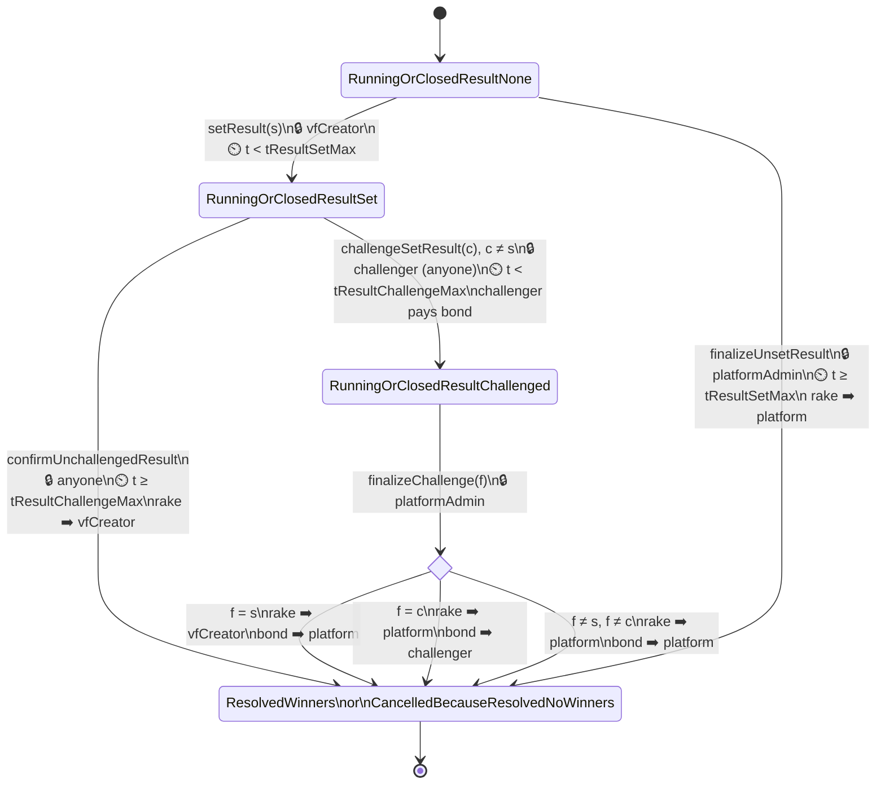

```mermaid
stateDiagram-v2
    state "ResolvedWinners\nor\nCancelledBecauseResolvedNoWinners" as Resolved
    state if_state <<choice>>
    [*] --> RunningOrClosedResultNone
    RunningOrClosedResultNone --> RunningOrClosedResultSet: setResult(s)\n🔒 vfCreator\n⏲️ t < tResultSetMax
    RunningOrClosedResultSet --> Resolved: confirmUnchallengedResult\n🔒 anyone\n⏲️ t ≥ tResultChallengeMax\nrake ➡️ vfCreator
    RunningOrClosedResultSet --> RunningOrClosedResultChallenged: challengeSetResult(c), c ≠ s\n🔒 challenger (anyone)\n⏲️ t < tResultChallengeMax\nchallenger pays bond
    RunningOrClosedResultChallenged --> if_state: finalizeChallenge(f)\n🔒 platformAdmin
    if_state --> Resolved: f = s\nrake ➡️ vfCreator\nbond ➡️ platform
    if_state --> Resolved: f = c\nrake ➡️ platform\nbond ➡️ challenger
    if_state --> Resolved: f ≠ s, f ≠ c\nrake ➡️ platform\nbond ➡️ platform
    RunningOrClosedResultNone --> Resolved: finalizeUnsetResult\n🔒 platformAdmin\n⏲️ t ≥ tResultSetMax\n rake ➡️ platform
    Resolved --> [*]
```
