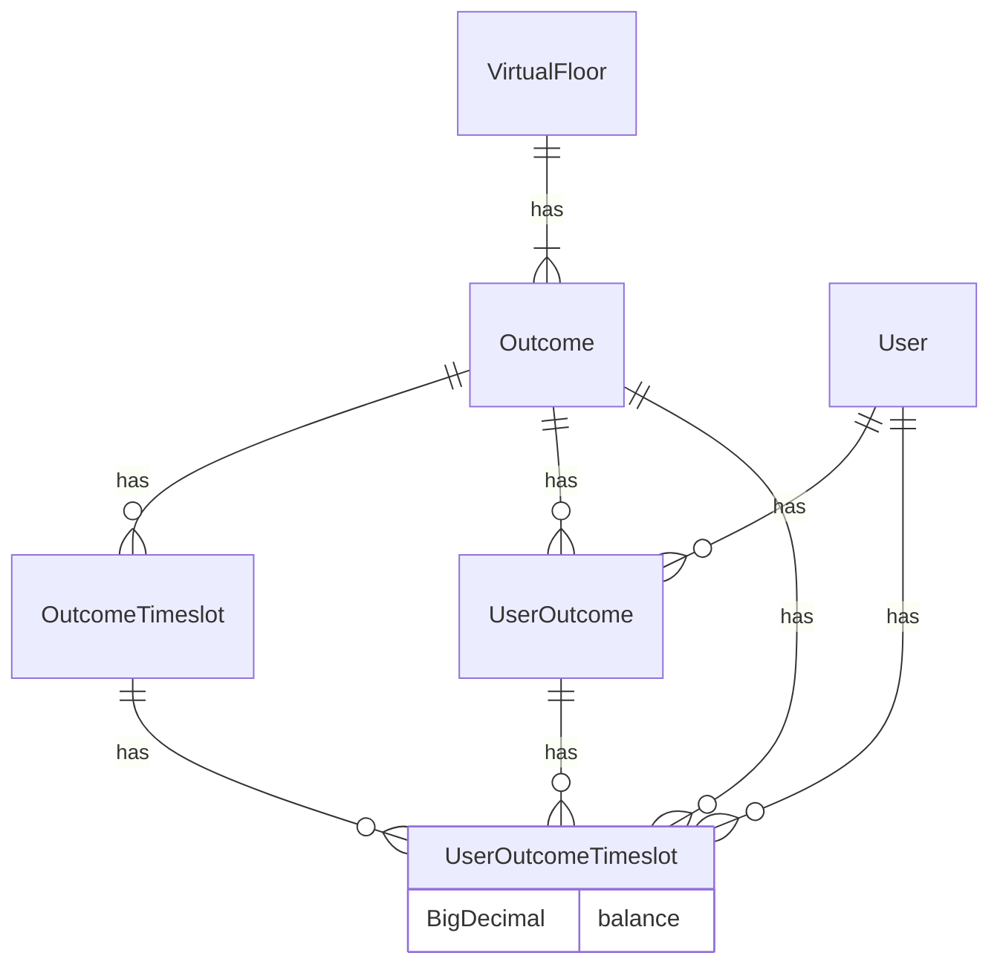

```mermaid
erDiagram
    VirtualFloor ||--|{ Outcome: has

    Outcome ||--o{ OutcomeTimeslot: has

    Outcome ||--o{ UserOutcome: has
    Outcome ||--o{ UserOutcomeTimeslot: has

    User ||--o{ UserOutcome: has
    User ||--o{ UserOutcomeTimeslot: has

    UserOutcome ||--o{ UserOutcomeTimeslot: has
    OutcomeTimeslot ||--o{ UserOutcomeTimeslot: has

    UserOutcomeTimeslot {
        BigDecimal balance
    }

```
