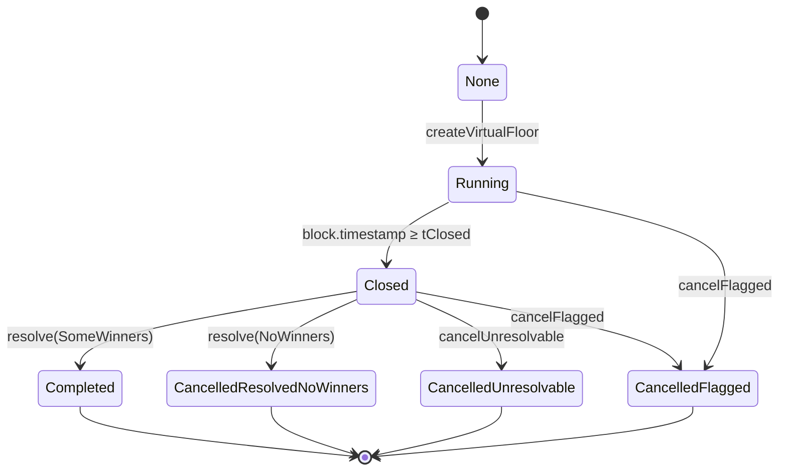
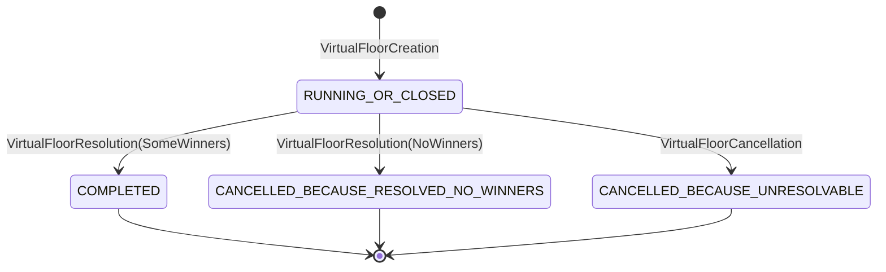

# Virtual-floor state diagrams

## Contract

Note that on the contract:

- `Running` is represented by `state == RunningOrClosed && block.timestamp < tClosed`
- `Closed` is represented by `state == RunningOrClosed && block.timestamp ≥ tClosed`

## Graph

