# Virtual-floor state diagrams

## On-chain `VirtualFloor.internalState` stored value

```mermaid
stateDiagram-v2
    state resolutionType <<choice>>

    [*] --> None

    None --> RunningOrClosed: createVirtualFloor

    RunningOrClosed --> CancelledFlagged: cancelFlagged\n🔒 platformAdmin\n⏲️ any time

    RunningOrClosed --> CancelledUnresolvable: cancelUnresolvable\n🔓 anyone\n⏲️ tClose ≤ t\nhas commits to < 2 outcomes

    RunningOrClosed --> resolutionType: _resolve(f)\n🔒 internal\n⏲️ tResolve ≤ t\nhas commits to ≥ 2 outcomes
    resolutionType --> CancelledResolvedNoWinners: CancelledNoWinners
    resolutionType --> ResolvedWinners: Winners

    CancelledFlagged --> [*]
    CancelledUnresolvable --> [*]
    CancelledResolvedNoWinners --> [*]
    ResolvedWinners --> [*]
```

## On-chain `getVirtualFloorState()` return-value

```mermaid
stateDiagram-v2
    state RunningOrClosed_Closed <<choice>>
    state resolutionType <<choice>>
    [*] --> None

    None --> RunningOrClosed_Running: createVirtualFloor()

    RunningOrClosed_* --> CancelledFlagged: cancelFlagged()

    RunningOrClosed_Running --> RunningOrClosed_Closed: t ≥ tClose
    RunningOrClosed_Closed --> RunningOrClosed_ClosedUnresolvable: has commits to < 2 outcomes
    RunningOrClosed_Closed --> RunningOrClosed_ClosedPreResolvable: has commits to ≥ 2 outcomes


    RunningOrClosed_ClosedUnresolvable --> CancelledUnresolvable: cancelUnresolvable()
    RunningOrClosed_ClosedPreResolvable --> RunningOrClosed_ClosedResolvable: t ≥ tResolve



    RunningOrClosed_ClosedResolvable --> resolutionType: _resolve()
    resolutionType --> CancelledResolvedNoWinners: CancelledNoWinners
    resolutionType --> ResolvedWinners: Winners


    CancelledFlagged --> [*]
    CancelledUnresolvable --> [*]
    CancelledResolvedNoWinners --> [*]
    ResolvedWinners --> [*]
```

All `RunningOrClosed_*` states are represented with a single on-chain `internalState` of `RunningOrClosed`, but the `getVirtualFloorState()` function combines `internalState` with other inputs to determine the actual state.

## ChallengeableCreatorOracle

We now explode the `RunningOrClosed_ClosedResolvable` state into further sub-states, as stored on the `ChallengeableCreatorOracle` contract:

The only details that are not visible in this diagram are that:
1. When the base contract’s “computed” state (as reported by `getVirtualFloorState()`) goes into `CancelledResolvedNoWinners | ResolvedWinners`, in the extending `ChallengeableCreatorOracle` contract the corresponding `Resolution.state` for that VF will be moved (in parallel) to state `ResolutionState.Complete`.
2. If a VF set-result has been challenged, and therefore its `Resolution.state` in `ChallengeableCreatorOracle` is `ResolutionState.Challenged`, if at that moment the base contract’s state is forced by the platform-admin into `CancelledFlagged`, the `Resolution.state` will be moved (in parallel) into `ResolutionState.ChallengeCancelled`.
